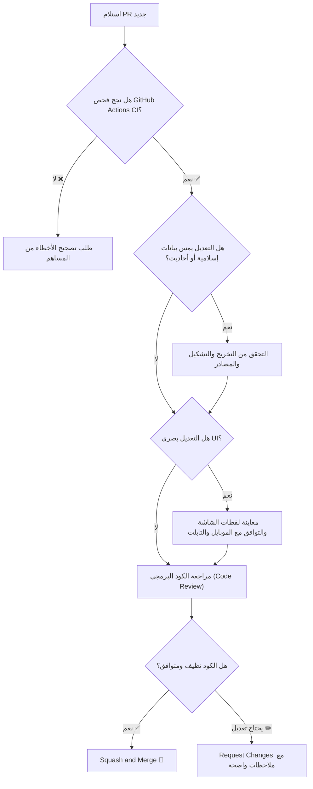

# 🛡️ دليل صاحب المشروع لمراجعة وقبول الـ Pull Requests (Maintainer Guide)

هذا الدليل مخصص لك لإدارة المستودع ومراجعة وقبول مساهمات المطورين (PRs) بكفاءة وسرعة وأمان.

---

## 🔍 خطوات مراجعة أي Pull Request جديد



---

## 📋 قائمة المراجعة السريعة (Review Checklist)

### 1. الفحص الآلي (CI Checks)

- تأكد أن شارة **GitHub Actions CI** خضراء `All checks have passed`.
- الفحص الآلي يقوم تلقائياً بـ:
  1. التحقق من بناء المشروع بالكامل (`npm run build`).
  2. فحص معادلات المواقيت الـ 12 والأذكار.
  3. فحص البوصلة والـ Service Worker.
  4. فحص اتساق الـ RTL والخطوط.

### 2. مراجعة التغييرات في الكود (Files Changed)

- اضغط على تبويب **"Files changed"** في صفحة الـ PR.
- تأكد أنه لم تتم إضافة أي مكتبات خارجية غير ضرورية في `package.json`.
- تأكد من عدم وجود كود زائد أو تعليقات تجريبية (`console.log` غير مفيدة).

### 3. التدقيق الشرعي (إذا كان التعديل في الأذكار أو المواقيت)

- افتح ملفات `src/data/athkarData.js` أو `src/services/prayerEngine.js`.
- تأكد من التشكيل الكامل والصحيح للأذكار ووجود مصدر معتمد في التخريج.

### 4. تجربة الكود محلياً (اختياري للتعديلات الكبيرة)

```bash
# سحب فرع المساهم لتجربته محلياً على جهازك
git fetch origin pull/<PR_NUMBER>/head:pr-<PR_NUMBER>
git checkout pr-<PR_NUMBER>

# تشغيل التطبيق وتجربته
npm run dev
```

---

## 🚀 كيفية قبول ودمج الـ PR (Merging)

1. في أسفل صفحة الـ PR في GitHub، اختر خيار:
   👉 **`Squash and merge`** _(الموصى به للحفاظ على نظافة سجل الـ Git)_.
2. اكتب رسالة موجزة وواضحة تلخص التعديل (مثل: `feat: add evening athkar audio support (#12)`).
3. اضغط **Confirm Squash and Merge**.
4. اشكر المساهم في تعليق لطيف وشجعه على المساهمة مجدداً! 🌟

---

## 📦 تحديث تطبيق الأندرويد بعد دمج التعديلات

بعد دمج أي PR جديد في فرع `main`:

```bash
git checkout main
git pull origin main
npm run build
npx cap sync android
```

ثم يمكنك بناء ملف APK جديد عبر Android Studio أو سطر الأوامر.
