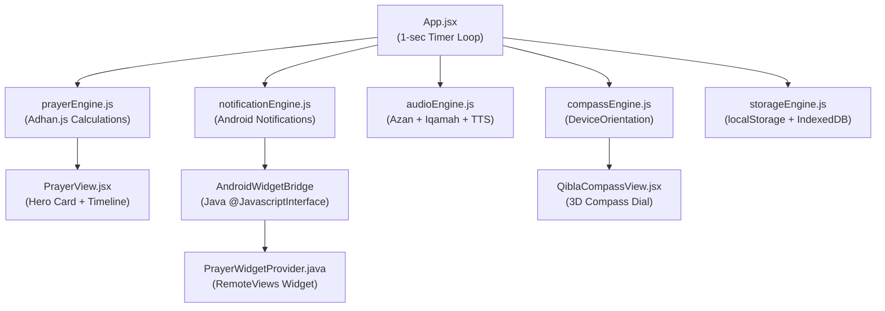

# 🕌 Prayer-Azkar — Complete Project Discovery Report

> **Repository**: [Mohamed-Mohamed-Hozien/Prayer-Azkar](https://github.com/Mohamed-Mohamed-Hozien/Prayer-Azkar)  
> **Package Name**: `com.prayertimes.athkar`  
> **App Name**: صلاتي وأذكاري  
> **Version**: v1.0.0  
> **APK Size**: ~30 MB (24.74 MB is audio)  
> **Stack**: React 19 + Vite 6 + Capacitor 8 + Android Native (Java)  
> **Fully Offline**: ✅ PWA Service Worker + Local Audio + No Backend

---

## 📁 Complete Directory Map

```
Prayer-Azkar/
├── .agents/                              # AI Agent customizations
│   └── skills/                           # 4 workspace skills
│       ├── audio-asset-optimizer/         # Skill 2: Audio compression audit
│       │   ├── SKILL.md
│       │   └── scripts/compress-audio.mjs
│       ├── islamic-data-verifier/         # Skill 3: Astronomical & Hadith verifier
│       │   ├── SKILL.md
│       │   └── scripts/verify-calculations.mjs
│       ├── mobile-sensors-testing/        # Skill 1: Sensor fusion & offline tests
│       │   ├── SKILL.md
│       │   └── scripts/simulate-sensors.mjs
│       └── rtl-arabic-ux-linter/          # Skill 4: Arabic RTL layout linter
│           ├── SKILL.md
│           └── scripts/lint-arabic-rtl.mjs
│
├── android/                              # Capacitor Android native project
│   ├── app/
│   │   └── src/main/java/com/prayertimes/athkar/
│   │       ├── MainActivity.java          # WebView + AndroidWidgetBridge @JavascriptInterface
│   │       └── PrayerWidgetProvider.java  # Native 4x2 Home Screen Widget (RemoteViews)
│   ├── build.gradle
│   ├── gradlew / gradlew.bat
│   └── variables.gradle
│
├── public/                               # Static assets (served at /)
│   ├── audio/                            # 8 offline Azan & Iqamah audio files
│   │   ├── azan-abdulbasit.mp3   (3.63 MB)
│   │   ├── azan-alafasy.mp3      (2.86 MB)
│   │   ├── azan-alaqsa.mp3       (5.13 MB)
│   │   ├── azan-fajr.mp3         (3.26 MB)
│   │   ├── azan-madinah.mp3      (3.26 MB)
│   │   ├── azan-makkah.mp3       (3.26 MB)
│   │   ├── iqamah-beep.wav       (0.08 MB)
│   │   └── takbeer.mp3           (3.26 MB)
│   ├── icons/
│   │   ├── icon-192.svg           # PWA icon (192x192)
│   │   ├── icon-512.svg           # PWA icon (512x512)
│   │   └── mosque-icon.svg        # Favicon / status bar icon
│   └── sw.js                      # Duplicate (also at root)
│
├── scripts/                              # Build & setup utilities
│   ├── download_audio.js          # Downloads Azan MP3s from URLs
│   ├── probe_audio.js             # Probes audio metadata (bitrate, duration)
│   └── setup_offline_audio.js     # Bulk audio setup script
│
├── src/                                  # React application source
│   ├── main.jsx                   # React DOM entry point
│   ├── App.jsx                    # Root component (298 lines)
│   ├── index.css                  # Master stylesheet (32 KB, 800+ lines)
│   ├── components/                # 15 React components
│   │   ├── AthkarFocusMode.jsx    # Swipeable card-by-card Athkar reading
│   │   ├── AthkarListMode.jsx     # Vertical scrollable Athkar list
│   │   ├── AthkarView.jsx         # Athkar tab container + Tasbeeh switcher
│   │   ├── AudioSettings.jsx      # Azan reciter picker + custom upload
│   │   ├── BottomNav.jsx          # 4-tab Android navigation bar
│   │   ├── CustomZikrModal.jsx    # Modal for adding personal Athkar
│   │   ├── DigitalTasbeeh.jsx     # Smart electronic tasbeeh with 10 presets
│   │   ├── FloatingAzanBanner.jsx # Dismissible Azan playback overlay
│   │   ├── LocationModal.jsx      # City picker popup
│   │   ├── LocationSettings.jsx   # GPS & manual city configuration
│   │   ├── PrayerView.jsx         # Main prayer times + countdown hero
│   │   ├── QiblaCompassView.jsx   # 3D Qibla compass with sensor fusion
│   │   ├── SettingsView.jsx       # Settings hub with sub-tabs
│   │   ├── TimingSettings.jsx     # Prayer offset & Iqamah delay editors
│   │   └── WidgetSettings.jsx     # Home widget customizer (layout, style)
│   ├── data/                      # Static Islamic content databases
│   │   ├── athkarData.js          # 6 categories, 40+ authentic Athkar with Tashkeel
│   │   ├── citiesData.js          # 150+ cities with coordinates
│   │   └── islamicCalendar.js     # Hijri calendar, Sunnah fasting logic
│   └── services/                  # Engine modules (business logic)
│       ├── audioEngine.js         # Web Audio API + HTML5 Audio + Speech Synthesis
│       ├── compassEngine.js       # DeviceOrientation sensor fusion + manual fallback
│       ├── hapticEngine.js        # Capacitor Haptics + Web Vibration API
│       ├── notificationEngine.js  # Local notifications + MediaSession + Widget bridge
│       ├── prayerEngine.js        # Adhan.js calculations (12 methods, Qibla, Hijri)
│       ├── storageEngine.js       # localStorage + IndexedDB persistence
│       └── wakeLockEngine.js      # Screen wake lock for Qibla/Tasbeeh screens
│
├── dist/                          # Vite production build output
├── index.html                     # HTML entry (RTL, viewport-fit, Arabic fonts)
├── manifest.json                  # PWA manifest (standalone, portrait, RTL)
├── sw.js                          # Service Worker (Network-First + cache fallback)
├── vite.config.js                 # Vite dev server config (port 3000)
├── capacitor.config.json          # Capacitor: appId, webDir, plugins
├── package.json                   # Dependencies & scripts
├── .gitignore                     # Excludes node_modules, dist, .gradle, APK
├── ARCHITECTURE.md                # Technical architecture specification
├── WALKTHROUGH.md                 # Arabic & English feature walkthrough
├── README.md                      # Project summary
└── Prayer-Azkar-v1.0.0.apk       # Signed release APK (30.3 MB)
```

---

## 🏛️ Architecture Overview

### Data Flow



### Core Engine Modules

| Engine | File | Responsibility |
|:---|:---|:---|
| **Prayer Calculator** | `prayerEngine.js` | 12 astronomical methods via `adhan` library, Qibla bearing, Hijri date, countdown |
| **Audio Playback** | `audioEngine.js` | 9 built-in reciters, custom IndexedDB uploads, Web Audio synth fallback, Speech API |
| **Compass Fusion** | `compassEngine.js` | `DeviceOrientation` + `webkitCompassHeading`, low-pass filter, ±3° alignment |
| **Haptic Feedback** | `hapticEngine.js` | Capacitor `@capacitor/haptics` + `navigator.vibrate()` fallback |
| **Notifications** | `notificationEngine.js` | `@capacitor/local-notifications`, `MediaSession`, `AndroidWidgetBridge` |
| **Persistence** | `storageEngine.js` | `localStorage` (settings, tasbeeh, progress), `IndexedDB` (custom audio blobs) |
| **Wake Lock** | `wakeLockEngine.js` | `navigator.wakeLock` for keeping screen on during compass/tasbeeh |

### 4 Main App Tabs (Bottom Navigation)

| Tab | Component | Features |
|:---|:---|:---|
| 🕌 **الصلاة** | `PrayerView.jsx` | Next prayer hero, live countdown, 6-prayer timeline, Iqamah window, Sunnah fasting banner |
| 🧭 **القبلة** | `QiblaCompassView.jsx` | 3D compass rose, golden Kaaba needle, sensor/manual mode, distance to Kaaba |
| 📿 **الأذكار** | `AthkarView.jsx` | 6 categories (morning/evening/afterPrayer/sleep/tasbeeh/custom), focus & list modes, smart tasbeeh |
| ⚙️ **الإعدادات** | `SettingsView.jsx` | 4 sub-tabs: timings, audio, location, widget customizer |

---

## 📐 Prayer Calculation Methods (12 Methods)

| # | ID | Authority | Fajr Angle | Isha Angle/Offset |
|:---|:---|:---|:---:|:---:|
| 1 | `Egyptian` | الهيئة المصرية العامة | 19.5° | 17.5° |
| 2 | `UmmAlQura` | جامعة أم القرى | 18.5° | +90 min |
| 3 | `MuslimWorldLeague` | رابطة العالم الإسلامي | 18° | 17° |
| 4 | `NorthAmerica` | ISNA | 15° | 15° |
| 5 | `Dubai` | دائرة الشؤون الإسلامية - دبي | 18.2° | 18.2° |
| 6 | `Kuwait` | وزارة الأوقاف - الكويت | 18° | 17.5° |
| 7 | `Qatar` | وزارة الأوقاف - قطر | 18° | +90 min |
| 8 | `Karachi` | جامعة العلوم الإسلامية | 18° | 18° |
| 9 | `Singapore` | MUIS | 20° | 18° |
| 10 | `Turkey` | Diyanet (Custom) | 18° | 17° |
| 11 | `France` | UOIF (Custom) | 12° | 12° |
| 12 | `MoonsightingCommittee` | لجنة رؤية الهلال | 18° | 18° |

---

## 📿 Tasbeeh Presets (10 Authentic Athkar)

| # | ID | Arabic Text | Default Target | Hadith Virtue |
|:---|:---|:---|:---:|:---|
| 1 | `subhanallah` | سُبْحَانَ اللهِ | 33 | تغرس لك نخلة في الجنة |
| 2 | `alhamdulillah` | الحَمْدُ لِلَّهِ | 33 | تملأ الميزان بالخير |
| 3 | `allahuakbar` | اللهُ أَكْبَرُ | 33 | أفضل ما يُفتتح به الذكر |
| 4 | `lailahaillallah` | لَا إِلَهَ إِلَّا اللهُ | 100 | أفضل الذكر وخير ما قال النبيون |
| 5 | `astaghfirullah` | أَسْتَغْفِرُ اللهَ | 100 | تفريج الهموم وجلب الرزق |
| 6 | `lahawla` | لَا حَوْلَ وَلَا قُوَّةَ إِلَّا بِاللهِ | 33 | كنز من كنوز الجنة |
| 7 | `salawat` | اللَّهُمَّ صَلِّ عَلَى مُحَمَّدٍ | 100 | صلى الله عليه بها عشراً |
| 8 | `subhanallah_bihamdihi` | سُبْحَانَ اللهِ وَبِحَمْدِهِ العَظِيمِ | 100 | حبيبتان إلى الرحمن |
| 9 | `hasbiyallah` | حَسْبُنَا اللهُ وَنِعْمَ الوَكِيلُ | 33 | قالها إبراهيم حين ألقي في النار |
| 10 | `yunus_dua` | لَا إِلَهَ إِلَّا أَنْتَ سُبْحَانَكَ | 33 | لم يدعُ بها مسلم إلا استُجيب له |

---

## 🔊 Audio Assets (8 Files, 24.74 MB Total)

| File | Size | Reciter / Type |
|:---|:---:|:---|
| `azan-makkah.mp3` | 3.26 MB | أذان الحرم المكي |
| `azan-madinah.mp3` | 3.26 MB | أذان المسجد النبوي |
| `azan-alaqsa.mp3` | 5.13 MB | أذان المسجد الأقصى |
| `azan-alafasy.mp3` | 2.86 MB | مشاري العفاسي |
| `azan-abdulbasit.mp3` | 3.63 MB | عبد الباسط عبد الصمد |
| `azan-fajr.mp3` | 3.26 MB | أذان الفجر المكي |
| `takbeer.mp3` | 3.26 MB | تكبيرات |
| `iqamah-beep.wav` | 0.08 MB | نغمة إقامة |

---

## 🤖 Android Native Bridge

### `MainActivity.java`
- Extends `BridgeActivity` (Capacitor).
- Injects `AndroidWidgetBridge` as `@JavascriptInterface` on the WebView.

### `PrayerWidgetProvider.java`
- Reads `SharedPreferences("prayer_widget_prefs")`.
- Updates `RemoteViews(R.layout.prayer_widget_4x2)` with all 5 prayer times.
- Called from JS via `window.AndroidWidgetBridge.updateWidgetData(json)`.

---

## 🧪 Skill Verification Results (All 4 Passed ✅)

### Skill 1: Mobile Sensors & Offline Testing
```
✅ Cairo, Egypt:   136° (Expected ~136°)
✅ Makkah, KSA:    0° (At Kaaba)
✅ London, UK:     119° (Expected ~119°)
✅ New York, USA:   58° (Expected ~58°)
✅ Jakarta:        295° (Expected ~295°)
✅ 5/5 Bearings, 5/5 Alignments Verified
✅ Service Worker cache coverage confirmed
```

### Skill 2: Audio Asset Optimizer
```
📦 Current Audio Bundle: 24.74 MB
🎯 Optimized Estimate:    7.48 MB (96kbps VBR)
🚀 Potential Savings:    ~17.26 MB (APK → ~12.7 MB)
```

### Skill 3: Islamic Data Verifier
```
✅ 12/12 Calculation Methods Verified
✅ 10/10 Tasbeeh Presets Verified
✅  6/6  Athkar Categories Verified
```

### Skill 4: RTL Arabic UX Linter
```
✅ HTML lang="ar" dir="rtl" present
✅ viewport-fit=cover for notch handling
✅ --safe-top/--safe-bottom CSS variables declared
✅ Arabic typography stack (Amiri, Noto Naskh) declared
✅ touch-action: manipulation enabled
✅ 0 Issues Found
```

---

## 📦 Dependencies

| Package | Version | Purpose |
|:---|:---|:---|
| `react` | ^19.0.0 | UI framework |
| `react-dom` | ^19.0.0 | DOM renderer |
| `adhan` | ^4.4.3 | Astronomical prayer time calculations |
| `lucide-react` | ^1.16.0 | Icon library (60+ icons used) |
| `canvas-confetti` | ^1.9.4 | Tasbeeh completion celebration |
| `@capacitor/core` | ^8.5.0 | Native bridge framework |
| `@capacitor/android` | ^8.5.0 | Android native platform |
| `@capacitor/haptics` | ^8.0.2 | Native vibration feedback |
| `@capacitor/local-notifications` | ^8.3.1 | Android notification system |
| `@capacitor/status-bar` | ^8.0.3 | Status bar color control |
| `vite` | ^6.2.0 | Build tool & dev server |
| `@vitejs/plugin-react` | ^4.3.4 | React JSX transforms |
